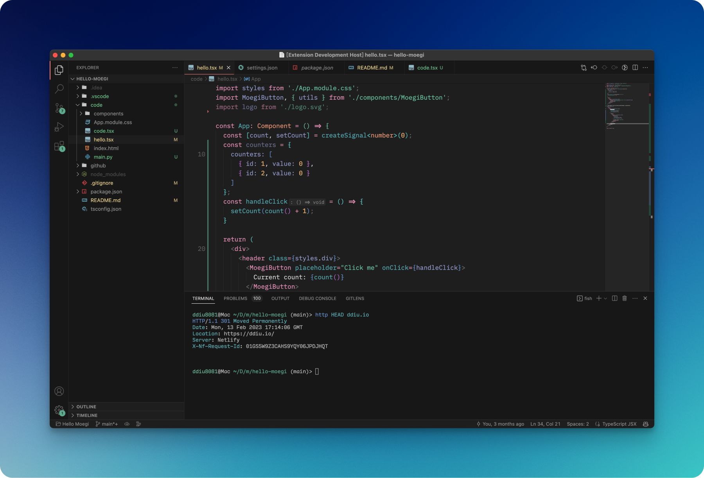
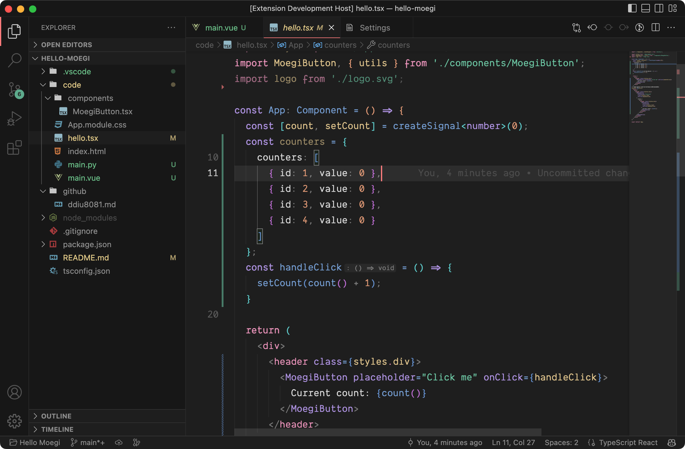
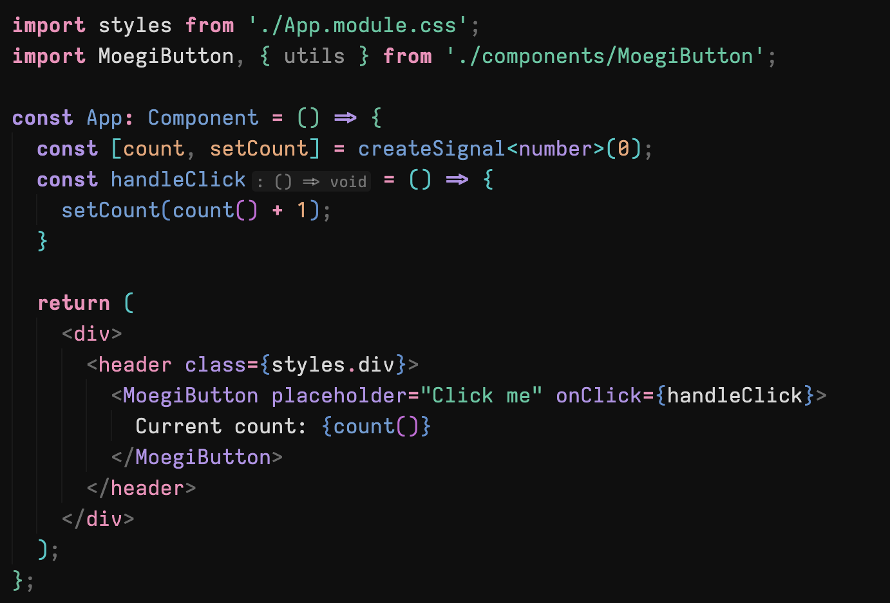
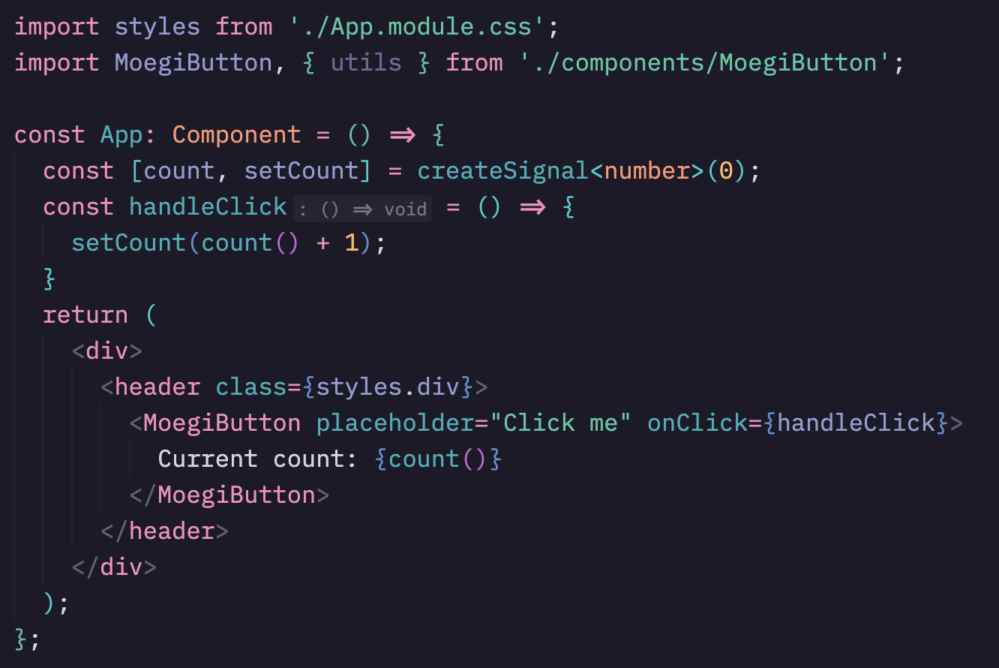
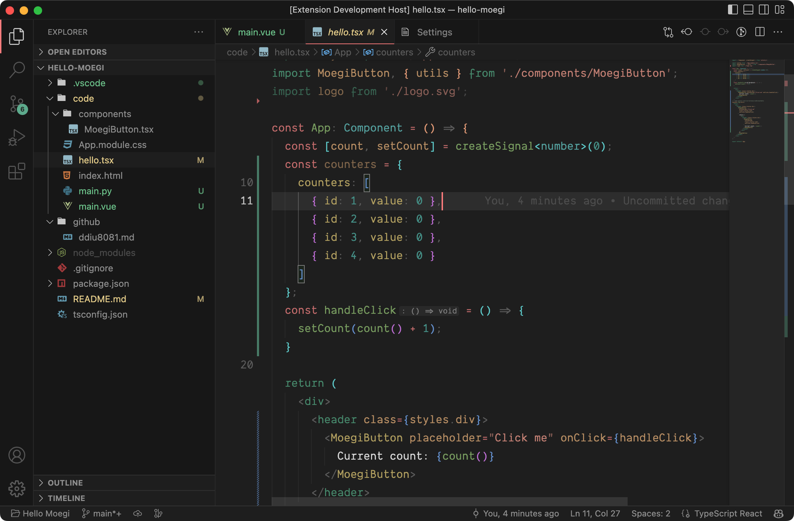
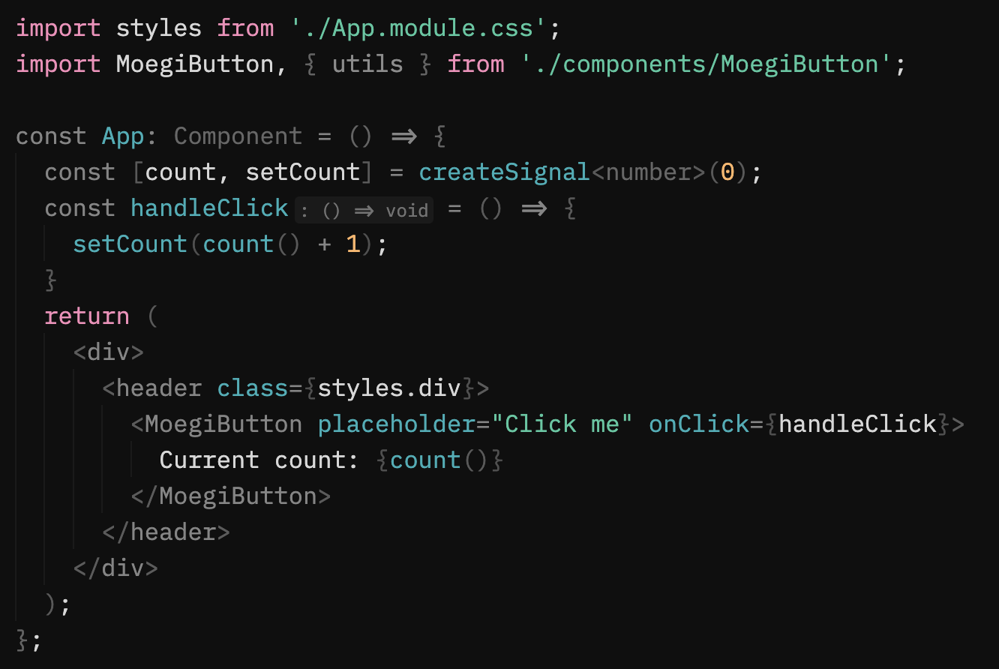
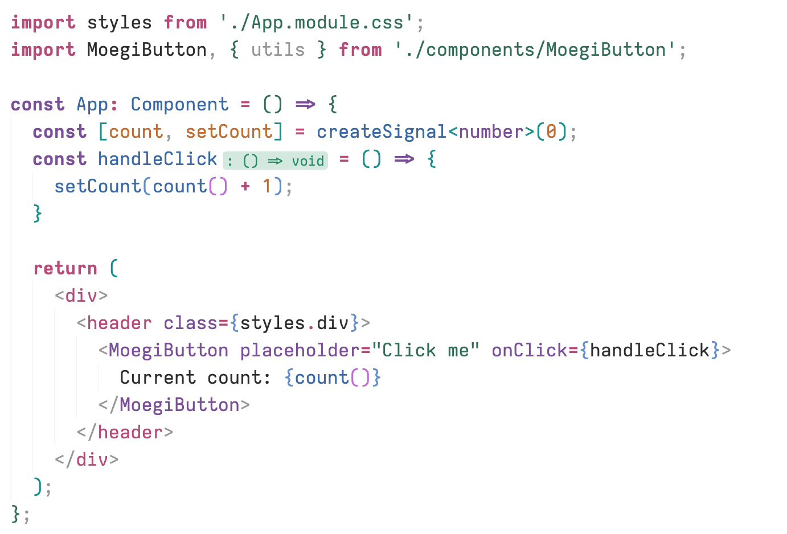
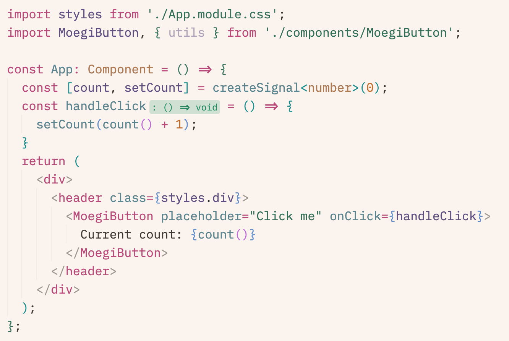
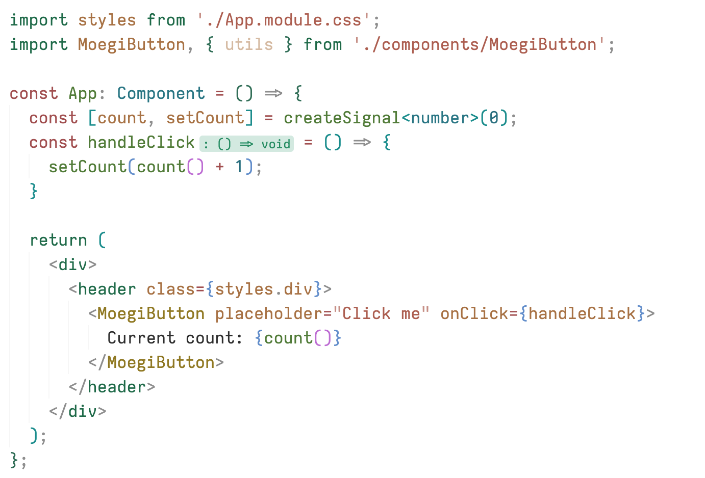

# Moegi Theme for VSCode

[](https://marketplace.visualstudio.com/items?itemName=ddiu8081.moegi-theme)
[](https://marketplace.visualstudio.com/items?itemName=ddiu8081.moegi-theme)
[](https://vscode.dev/theme/ddiu8081.moegi-theme)



> Font: [IBM Plex Mono](https://github.com/IBM/plex)

## Features

- Two accent colors in one theme - unsaturated cold green (`#66b395`) and... light warm red (`#ff8787`)
- No flat ui - you work in a real editor instead of on a whiteboard
- MacOS native title bar adaptation - pure gray ui without color bias
- Optimized for text selection and search

## Themes

| Theme | Preview | Description |
| --- | --- | --- |
| Moegi Dark |  [Online Preview](https://vscode.dev/theme/ddiu8081.moegi-theme/Moegi%20Dark) | A pure dark theme. |
| Moegi Black |  [Online Preview](https://vscode.dev/theme/ddiu8081.moegi-theme/Moegi%20Black) | A pure dark theme but more black. |
| Moegi Space |  [Online Preview](https://vscode.dev/theme/ddiu8081.moegi-theme/Moegi%20Space) | A cooler dark theme. |
| Moegi Dark Vitesse |  [Online Preview](https://vscode.dev/theme/ddiu8081.moegi-theme/Moegi%20Dark%20Vitesse) | [Vitesse](https://github.com/antfu/vscode-theme-vitesse) stylized dark theme |
| Moegi Black Zen |  [Online Preview](https://vscode.dev/theme/ddiu8081.moegi-theme/Moegi%20Black%20Zen) | A pure dark theme with limited highlighting. |
| Moegi Light |  [Online Preview](https://vscode.dev/theme/ddiu8081.moegi-theme/Moegi%20Light) | A pure light theme. |
| Moegi Dawn |  [Online Preview](https://vscode.dev/theme/ddiu8081.moegi-theme/Moegi%20Dawn) | Light theme with yellow tones. |
| Moegi Iris | [Online Preview](https://vscode.dev/theme/ddiu8081.moegi-theme/Moegi%20Iris) | Light theme with purple tones. |
| Moegi Light Vitesse |  [Online Preview](https://vscode.dev/theme/ddiu8081.moegi-theme/Moegi%20Light%20Vitesse) | [Vitesse](https://github.com/antfu/vscode-theme-vitesse) stylized light theme |

## Installation

1. Open **Extensions** sidebar panel in Visual Studio Code.
2. Search for `Moegi Theme`.
3. Click **Install** to install it.

## Customization

You can customize the theme by adding snippets to `settings.json` (`Command Palette` -> `Preferences: Open Settings (JSON)`)

> For more information, please refer to [Theme Color Reference](https://code.visualstudio.com/api/references/theme-color)

### Enable Italics on Comments

```json
"editor.tokenColorCustomizations": {
  "[Moegi Dark][Moegi Black][Moegi Light]": {
    "textMateRules": [
      {
        "name": "Comment Italics",
        "scope": [
          "comment",
          "punctuation.definition.comment"
        ],
        "settings": {
          "fontStyle": "italic"
        }
      }
    ]
  }
}
```

### Enable Bold on Keywords

```json
"editor.tokenColorCustomizations": {
  "[Moegi Dark][Moegi Black][Moegi Light]": {
    "textMateRules": [
      {
        "name": "Keyword Bold",
        "scope": [
          "keyword",
          "storage.type",
          "storage.modifier",
        ],
        "settings": {
          "fontStyle": "bold" // If you want to enable italics as well, use "bold italic"
        }
      }
    ]
  }
}
```

## Credits

- Language examples are from [atom/language-examples](https://github.com/atom/language-examples).

## See More

- [Moegi Theme for Jetbrains](https://github.com/moegi-design/jetbrains-theme)

## License

MIT
