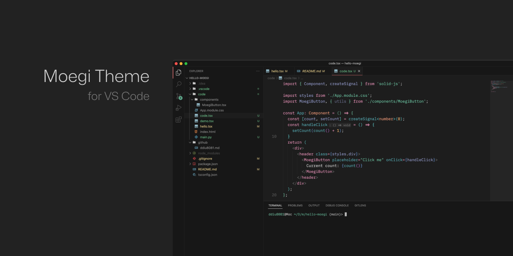

# Moegi Theme for VSCode

[](https://marketplace.visualstudio.com/items?itemName=ddiu8081.moegi-theme)
[](https://vscode.dev/theme/ddiu8081.moegi-theme)



> Font: [Zed Mono](https://github.com/zed-industries/zed-fonts)

## Features

- NO flat ui
- MacOS native title bar adaptation
- Accent colors in appropriate areas
- Optimized for text selection and search

## Themes

| Theme | Preview | Description |
| --- | --- | --- |
| Moegi Dark |  | A dark theme with a touch of pink. |
| Moegi Light |  | // TODO |
| Moegi Dark Monochrome |  | // TODO |
| Moegi Light Monochrome |  | // TODO |

## Installation

1. Open **Extensions** sidebar panel in Visual Studio Code.
2. Search for `Moegi Theme`.
3. Click **Install** to install it.

## Customization

You can customize the theme by adding snippets to `settings.json` (`Command Palette` -> `Preferences: Open Settings (JSON)`)

> For more information, please refer to [Theme Color Reference](https://code.visualstudio.com/api/references/theme-color)

### Enable Italics on Comments

```json
"editor.tokenColorCustomizations": {
  "[Moegi Dark]": {
    "textMateRules": [
      {
        "name": "Comment Italics",
        "scope": [
          "comment",
          "punctuation.definition.comment"
        ],
        "settings": {
          "fontStyle": "italic"
        }
      }
    ]
  }
}
```

### Enable Bold on Keywords

```json
"editor.tokenColorCustomizations": {
  "[Moegi Dark]": {
    "textMateRules": [
      {
        "name": "Keyword Bold",
        "scope": [
          "keyword",
          "storage.type",
          "storage.modifier",
        ],
        "settings": {
          "fontStyle": "italic"
        }
      }
    ]
  }
}
```

## Credits

- Language examples are from [atom/language-examples](https://github.com/atom/language-examples).

## License

MIT
